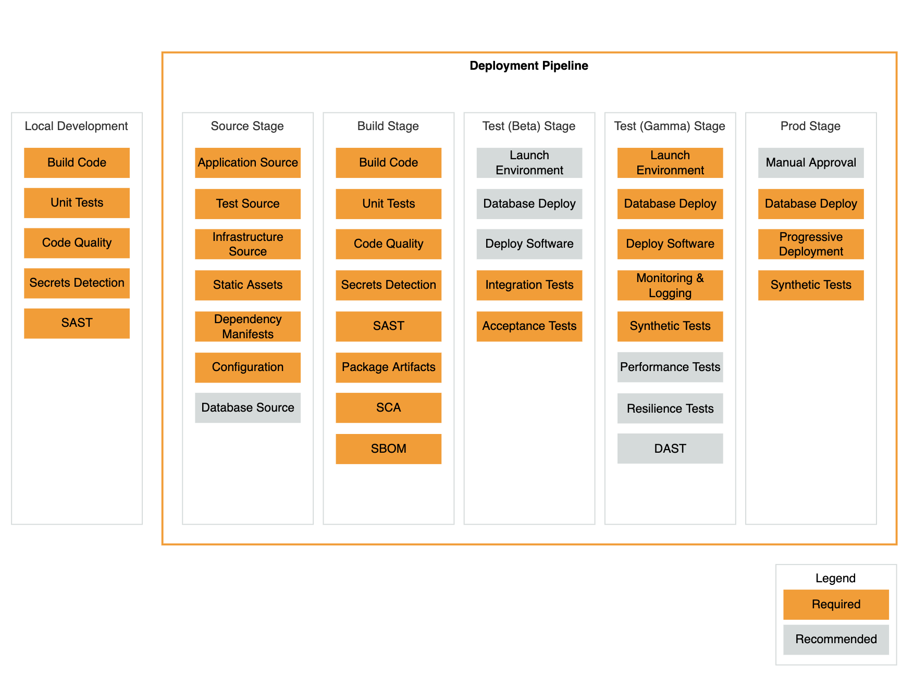

# Deployment
This part of the project documentation focuses on an
[**deployment** approach](https://pipelines.devops.aws.dev/application-pipeline/)



## Local Development

As defined in the [AWS Reference](https://pipelines.devops.aws.dev/application-pipeline/ri-cdk-pipeline/) Local development is based on pre-commit hooks.

Additionaly make is used

### Build code

### Unit Test

```console
foo@bar:~$ make test
#source .venv/bin/activate; pytest tests/*
source .venv/bin/activate; pytest --cov-report html --cov=project
======================test session starts =================
platform darwin -- Python 3.9.11, pytest-7.1.3, pluggy-1.0.0
rootdir: /Users/setzt/tmp_mkdocs/mkdocs_documentation, configfile: pytest.ini
plugins: cov-4.0.0
collected 3 items

project/proj.py ..                                                                                                              [ 66%]
tests/test_one.py .                                                                                                             [100%]

---------- coverage: platform darwin, python 3.9.11-final-0 ----------
Coverage HTML written to dir htmlcov


========================3 passed in 0.10s =====================


```
To see a detailed coverage report -

```console
foo@bar:~$ open htmlcov/index.html
```


### Code Quality

flake8, black, mypy added as precommmit hooks

in  ".pre-commit-config.yaml"

### Secrets detection

detect private key added as precommit hook in .pre-commit-config.yaml

 -   id: detect-private-key       # checks for private keys (BEGIN X PRIVATE KEY, etc.)

### SAST

TBD
